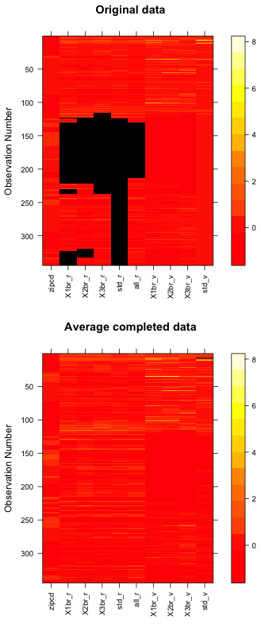
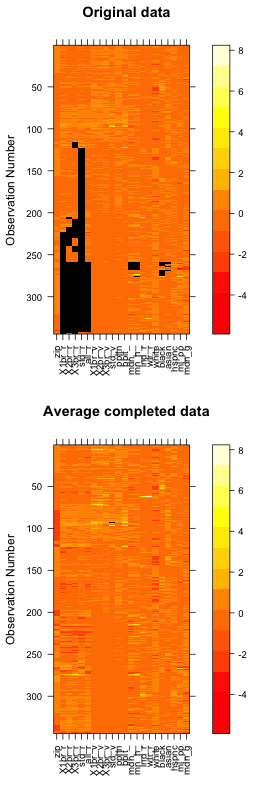

# Assignment

We would like you to convey the current state of the housing situation in the Bay Area using data files that we will provide. This could be in the form of extracting insights from the data, visualizing some relations, predicting missing values, creating an interactive map, etc. Of course, you're welcome to combine multiple approaches. Our interest is in gauging not just your technical skills but also how well you can make the data tell a story.

We provide three data files. You are welcome to find additional sources to use in your analysis but this is not mandatory.

* rent_data.csv - Contains median rental prices (in USD) and the number of available apartments per zip code. Data is provided for 1,2,3 bedroom and studio apartments. The column "all_rent" contains the median rent for all the apartment types in the zip code. There are missing values in the table for some zip codes.
* bayarea_zips.geojson - Contains the geographical representation of Bay Area zip codes. Could be useful for making maps.
* census.csv - Demographics information for each ZIP code (mean income, population, etc.)

Time to complete: 2 days.

# Approach

1. Predict missing values in the data set (using Expecectation Maximization with the R package 'mi') based on rent_data.csv
2. Combine rent_data.csv and census.csv, repeat step 1. Compare results.
3. Incorporate the data from step 2 (rent_data.csv + census.csv + predictions) into bayarea\_zips.geojson
4. Build a SVG-based interactive visualization with D3.js that uses data from step 3

# Setup
We assume an OS X system.

### Node.js, npm
	brew install node # should be at least 0.12
	brew install npm
	npm install -g http-server ya-csv

### R
	sudo brew cask install xquartz
	brew tap homebrew/science
	brew install R
	brew cask install rstudio

Install the 'mi' package through RStudio.

### Project files
	git clone git@github.com:mattiasarro/teleport-assignment.git
	cd teleport-assignment

# Data Prediction
There are many valid ways to predict the missing values of rent_data.csv, such as multivariate linear regression or polynomial regression.
We will be using Expecectation Maximization with the R package 'mi'. 
## Using just rent_data.csv [1]

Documentation:

* http://cran.r-project.org/web/packages/mi/mi.pdf
* http://cran.r-project.org/web/packages/mi/vignettes/mi_vignette.pdf

This section outlines the 'interesting' steps (see predict\_missing\_rent\_data.R for full code).

	> mdf <- missing_data.frame(read.csv('data/rent_data.csv'))
	> summary(mdf)
	    zipcode        X1br_rent      X2br_rent      X3br_rent     studio_rent      all_rent   
	 Min.   :93635   Min.   : 950   Min.   : 900   Min.   :1500   Min.   : 775   Min.   : 875  
	 1st Qu.:94517   1st Qu.:1508   1st Qu.:1895   1st Qu.:2422   1st Qu.:1424   1st Qu.:1850  
	 Median :94706   Median :1844   Median :2357   Median :3120   Median :1650   Median :2287  
	 Mean   :94771   Mean   :1956   Mean   :2542   Mean   :3296   Mean   :1707   Mean   :2340  
	 3rd Qu.:95112   3rd Qu.:2260   3rd Qu.:3000   3rd Qu.:3794   3rd Qu.:1995   3rd Qu.:2763  
	 Max.   :95694   Max.   :3950   Max.   :6000   Max.   :7250   Max.   :3243   Max.   :4307  
	                 NA's   :122    NA's   :111    NA's   :122    NA's   :219    NA's   :83    
	 X1br_availability X2br_availability X3br_availability studio_availability
	 Min.   :  0.0     Min.   :  0.00    Min.   : 0.00     Min.   :  0.000    
	 1st Qu.:  0.0     1st Qu.:  1.00    1st Qu.: 0.75     1st Qu.:  0.000    
	 Median :  7.0     Median : 12.00    Median : 8.00     Median :  1.000    
	 Mean   : 26.7     Mean   : 29.51    Mean   :11.56     Mean   :  5.055    
	 3rd Qu.: 37.0     3rd Qu.: 42.25    3rd Qu.:17.25     3rd Qu.:  5.000    
	 Max.   :355.0     Max.   :397.00    Max.   :75.00     Max.   :165.000
	 
	> show(mdf)
	Object of class missing_data.frame with 344 observations on 10 variables
    
	There are 14 missing data patterns
	                          type missing method  model
	zipcode             continuous       0   <NA>   <NA>
	X1br_rent           continuous     122    ppd linear
	X2br_rent           continuous     111    ppd linear
	X3br_rent           continuous     122    ppd linear
	studio_rent         continuous     219    ppd linear
	all_rent            continuous      83    ppd linear
	X1br_availability   continuous       0   <NA>   <NA>
	X2br_availability   continuous       0   <NA>   <NA>
	X3br_availability   continuous       0   <NA>   <NA>
	studio_availability continuous       0   <NA>   <NA>
    
	                      family     link transformation
	zipcode                 <NA>     <NA>    standardize
	X1br_rent           gaussian identity    standardize
	X2br_rent           gaussian identity    standardize
	X3br_rent           gaussian identity    standardize
	studio_rent         gaussian identity    standardize
	all_rent            gaussian identity    standardize
	X1br_availability       <NA>     <NA>    standardize
	X2br_availability       <NA>     <NA>    standardize
	X3br_availability       <NA>     <NA>    standardize
	studio_availability     <NA>     <NA>    standardize

The class (type in the table above) of all missing_variables is automatically guessed by R as "continuous". 
This sets other default behavior: 

* the imputation method will be ppd (posterior  predictive  distribution)
* use a linear model for the conditional distribution of the variable in the mi algorithm
* gaussian distribution family of the missing variable
* the missing variable should be standardized using twice the standard deviation of the observed values

Since the *_availability variables are counts (not continuous variables), we set their class/type accordingly and get the following show() output: 
  
                                                      
	> mdf <- change(mdf, 
	    y = c("X1br_availability", "X2br_availability", "X3br_availability", "studio_availability"), 
	    what = "type", 
	    to = c("count", "count", "count", "count"))
								
	> show(mdf)
	                          type missing method  model
	zipcode             continuous       0   <NA>   <NA>
	X1br_rent           continuous     122    ppd linear
	X2br_rent           continuous     111    ppd linear
	X3br_rent           continuous     122    ppd linear
	studio_rent         continuous     219    ppd linear
	all_rent            continuous      83    ppd linear
	X1br_availability        count       0   <NA>   <NA>
	X2br_availability        count       0   <NA>   <NA>
	X3br_availability        count       0   <NA>   <NA>
	studio_availability      count       0   <NA>   <NA>
    
	                      family     link transformation
	zipcode                 <NA>     <NA>    standardize
	X1br_rent           gaussian identity    standardize
	X2br_rent           gaussian identity    standardize
	X3br_rent           gaussian identity    standardize
	studio_rent         gaussian identity    standardize
	all_rent            gaussian identity    standardize
	X1br_availability       <NA>     <NA>           <NA>
	X2br_availability       <NA>     <NA>           <NA>
	X3br_availability       <NA>     <NA>           <NA>
	studio_availability     <NA>     <NA>           <NA>
	

Now let's run the actual imputation:

	> imputations <- mi(mdf, n.iter = 50, n.chains = 4, max.minutes = 20)

We want the mean of each completed variable to be roughly the same for each of the 4 chains.

	> Rhats(imputations)
	  mean_X1br_rent   mean_X2br_rent   mean_X3br_rent mean_studio_rent    mean_all_rent     sd_X1br_rent 
	        1.006875         2.513119         2.401626         1.187876         1.506352         1.025877 
	    sd_X2br_rent     sd_X3br_rent   sd_studio_rent      sd_all_rent 
	        1.143673         1.176181         1.097484         1.143057
	> imputations <- mi(imputations, n.iter = 5)
	> Rhats(imputations)
	  mean_X1br_rent   mean_X2br_rent   mean_X3br_rent mean_studio_rent    mean_all_rent     sd_X1br_rent 
	       0.9920765        0.9924230        0.9912734        0.9920388        0.9957200        0.9917080 
	    sd_X2br_rent     sd_X3br_rent   sd_studio_rent      sd_all_rent 
	       0.9921563        0.9916329        0.9919484        0.9923371
	> show(imputations)
	Object of class mi with 4 chains, each with 55 iterations.
	Each chain is the evolution of an object of missing_data.frame class with 344 observations on 10 variables.
  
Let's see how mi filled out the missing values:

	> image(imputations)

Finally, save the results as a CSV file.

	dfs <- complete(imputations, m = 2)
	write.csv(dfs, "rent_data_imputed.csv")

## Augmenting rent_data.csv with census.csv [2]

My first preference for merging these data would have been Ruby, but using JS reduces tyhe number of requirements needed to install (and languages to know/learn) by other team members who need to work with the data.

    node merge_census_and_rent_data.js

After running predict\_missing\_rent\_data.R we get the following image(imputations)

# Data Visualization
## Merge prediction data with GeoJSON data [3]

    node merge_full_imputed_to_bayarea_zips.js

## View the visualization [4]
	http-server
	open http://localhost:8080/

# Comments

# Further work
* Could tere be a way to specify correlations between variable pairs e.g. X1br_rent and X1br_availability?
* d3-style stuff could be lain ontop of gmaps
* viz elements that didn't make it
	* availability/price
	* outlining imputed values
	* displaying census data
	* charts for census data (e.g. pie chart of ethnicity)
	* choropleths for census data
	* filters
* properly looking at the data
* linear regression to see if there are interesting correlations (e.g. price / ethnicity)